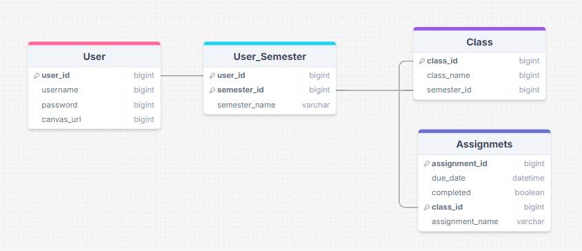

# LearningSuite & Canvas Calendar Integration
BYU Unified Calendar is a tool designed to consolidate class schedules from Learning Suite and Canvas into a single calendar view. By leveraging web scraping and an ICS file URL, the app fetches and syncs course schedules for a single BYU student, ensuring all classes appear in one place for easy access.

## Features
- **Web Scraping Integration** – Extracts class schedule data from **Learning Suite**.  
- **Canvas ICS Sync** – Imports course calendar data from Canvas via an **ICS file URL**.  
- **Unified Calendar View** – Displays all classes in a single interface for better organization.

## **Usage**  
1. Provide your **Canvas ICS file URL**.  
2. The app scrapes **Learning Suite** for additional class data.  
3. View your **complete schedule** in one place.


## **Technologies Used**  
- **Python** (for web scraping and processing)  
- **Selenium** (for Learning Suite scraping)  
- **Requests** (for handling ICS file fetching)  
- **SQLite** for storing calendar data locally.


## ERD Diagram



## **Setup & Installation**  
1. Clone the repository:  
   ```bash
   git clone https://github.com/your-repo/byu-unified-calendar.git
   cd byu-unified-calendar
   ```
2. Install dependencies:  
   ```bash
   ./install.sh
   ```
3. Run the app:  
   ```bash
   ./calendarApp.sh
   ```
